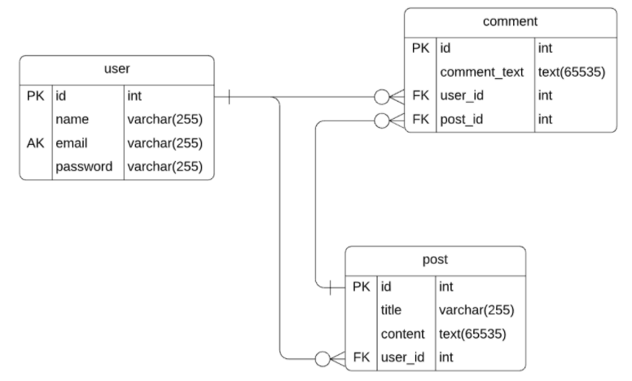

# 14-MVC-Tech-Blog

Homework #14: Model-View-Controller (MVC): Tech Blog

# Objectives

The primary objectives of this exercise were to demonstrate the following:

- practical implementation using express and routing (get, post, put, delete)
- practical implementation using Sequalize
- practical implementation using a front end framework (handlebars)
- deployment of complete application to heroku
- github repo management

# Dependencies

This exercise requires the following npm modules

- express
- sequalize
- handlebars
- heroku (deployment)

# Links

| Description       | Link                                         |
| ----------------- | -------------------------------------------- |
| github repo       | https://github.com/KS1/HW14-TechBlog |
| heroku deployment | https://kar1techblog.herokuapp.com/     |

# Routes

| Method | Route            | Description                                                                                                                                                                                                                                 |
| :----- | :--------------- | :------------------------------------------------------------------------------------------------------------------------------------------------------------------------------------------------------------------------------------------ |
| get    | /api/user        | Display all users                                                                                                                                                                                                                           |
| get    | /api/user/:id    | Display all posts and comments by a particular user id                                                                                                                                                                                      |
| post   | /api/user        | Creates a user with username and password and sets user to logged in - expects JSON object formatted:  `{` `"username": "`<em>`USERNAME`</em>`",` `"email": "`<em>`EMAIL`</em>`",` `"password": "`<em>`PASSWORD`</em>`"` `}` |
| post   | /api/user/login  | Logs user in - expects JSON object formatted:  `{` `"username": "`<em>`USERNAME`</em>`",` `"password": "`<em>`PASSWORD`</em>`"` `}`                                                                                             |
| post   | /api/user/login  | Logs user out - expects JSON object formatted:  `{` `"username": "`<em>`USERNAME`</em>`"` `}`                                                                                                                                      |
| get    | /api/post        | Display all posts and comments                                                                                                                                                                                                              |
| get    | /api/post/:id    | Display a single post and all comment                                                                                                                                                                                                       |
| post   | /api/post        | Creates a new post - expects JSON object formatted:  `{` `"title": "`<em>`TITLE`</em>`",` `"content": "`<em>`CONTENT`</em>`"` `}`                                                                                               |
| delete | /api/post/:id    | Deletes a post by post id                                                                                                                                                                                                                   |
| get    | /api/comment     | Get all Comments                                                                                                                                                                                                                            |
| get    | /api/comment/:id | Get Comment by ID                                                                                                                                                                                                                           |
| post   | /api/comment     | Create a new comment - expects JSON object formatted:  `{` `"comment_text": "`<em>`COMMENT_TEXT`</em>`",` `"post_id": "`<em>`POST_ID`</em>`"` `}`                                                                               |
| put    | /api/comment/:id | Update a comment by ID - expects JSON object formatted: `{` `"comment_text": "`<em>`COMMENT_TEXT`</em>`"` `}`                                                                                                                      |
| delete | /api/comment/:id | Deletes a commend by ID                                                                                                                                                                                                                     |

# ER Diagram

## Application MVC Structure

- `server.js` - The entry point to our application.
- `/config` - Database configuration
- `/controllers` - Most of the application's logic for requests and responses are done in this directory plus routes
- `/views` - Applications template files using handlebars.
- `/public` - All public facing assets are in this directory.
- `/models` - The application models for use with ORM.
- `/db` - Starter database files.
- `/assets` - Images.
- `/seeds` - Seed data and scripts.
- `/utils` - helpers and auth.
